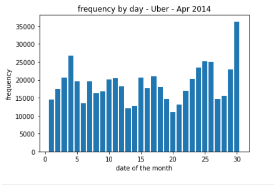
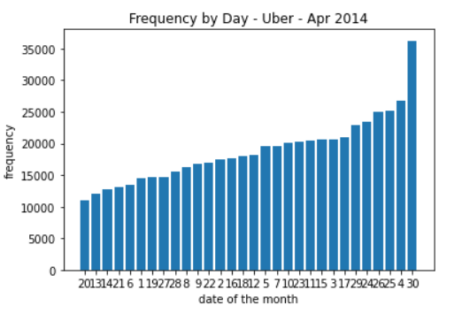
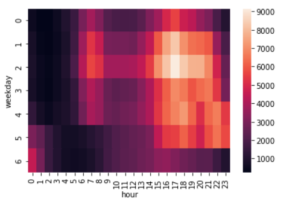

# Uber Data Analysis

Projeto feito com um Dataset com dados da Uber na cidade de Nova York em abril de 2014.

## Novos Aprendizados

- Explorando novos tipos de gráficos com Pandas

### Screenshots

    
    
    

